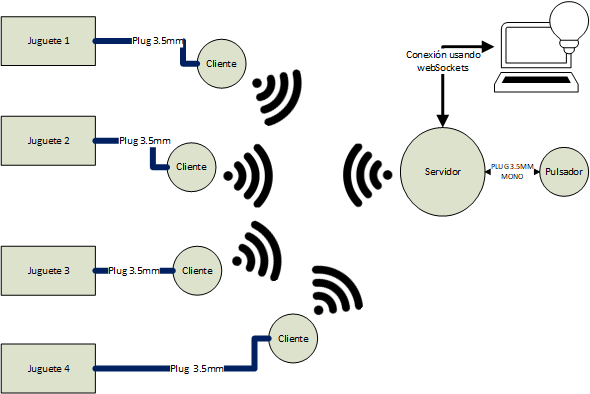

# Encendido remoto  -  version 1.0 

El proyecto, controla el encendido remoto (a distancia) de un circuito, en base a un receptor. Este receptor, se conecta a una red WiFi creada por un pulsador. Este pulsador al ser presionado, le envía la orden de encendido a todos los clientes (receptores), el cual realiza la activación de todos juntos. El servidor, y cliente, es alimentado mediante dos pilas AA de 1.5 V. También, puede utilizarse para encender cualquier otro tipo de circuito, siempre y cuando, no supere la corriente máxima admitida por el optoacoplador. El sistema diseñado, responde al siguiente esquema: 



La institución, que probará y realizará los test correspondientes a software y hardware, es APRILP (Asociacion pro rehabilitación infantil La Plata), y se usarán en juguetes, para chicos con discapacidad. Estos test, se documentarán para una proxima versión. Se aceptan sugerencias/modificación para realizar mejoras/upgrades del código. 

# Materiales 
   
   La siguiente lista de materiales, es la utilizada en este proyecto, y depende del circuito a encender. La elección del optoacoplador, depende de la corriente que maneje el circuito a encender. En este caso, se utiliza el PC817, por estar disponible comercialmente en Argentina.

1. ESP01 (al menos 2) 
2. PC817 (optoacoplador) uno por cada cliente que desee
3. Resistencias
    1. 1K (una por cada cliente) 
    2. 10K  (una por cada cliente) 
4. Portapilas 
5. Programador ESP01 o simil 
6. Pilas AA (opcional,puede utilizarse cualquier otra fuente de  alimentación. En este proyecto, se utiliza este tipo de pilas). Se usan dos por dispositivo

Este proyecto, puede realizarse con cualquier microcontrolador de la linea de esp8266/esp32, modificando los puertos correspondientes dentro del código. Se sugiere usar el ESP01, por su bajo coste en comparación con los demas 

# Programación ESP01 

Si usted conoce el método de programación del ESP01, puede saltearse la presente sección. 

La programación puede realizarse de dos maneras: 

    1. Usando un adaptador CH340 a USB. Estos se pueden comprar comercialmente, y no se requiere el armado de un circuito externo
    2. Usando un adaptador USB a UART. Por ejemplo PL2303 o CP2102 

En este caso, se usa el adaptador CP2102. El circuito que debe armarse, responde al siguiente diagrama: 


Para realizar el test del circuito, para la carga del sketch, se debe instalar la placa ESP8266 dentro del [Arduino IDE](https://www.luisllamas.es/programar-esp8266-con-el-ide-de-arduino/ "guía para instalación esp8266 en arduino IDE"). Una vez instalada la placa ESP8266, dentro del arduino IDE, se debe elegir un código de ejemplo, y proceder de la siguiente forma, para poder cargar el código: 
    
    1 Presionar el boton de reset
    2 Presionar simultameamente el otro pulsador (GPIO 0)
    3 Soltar el boton de reset, manteniendo presionado el pulsador GPIO0 
    4 Soltar el boton de GPIO 0.

Una vez realizados estos pasos, se presiona el boton "upload" en el arduino IDE, y se debe cargar el sketch. Una vez finalizada la carga, se debe presionar nuevamente el boton de reset, para que el programa empiece a correr. 


# Estructura del proyecto

Aquí, se mencionan los archivos principales, y carpetas utilizadas para el desarrollo del proyecto. Estos son: 
```
 ├── sortedMACS.py
 ├── delay.html  
 ├── index.html
 ├── ReceptorBotonAprilp
        └── src 
 ├── ServidorBotonAprilp    
        └── src 
```
Los archivos [delay.html](delay.html) e [index.html](index.html), poseen la página principal del servidor. Estos códigos se encuentran replicados en ServidorBotonAprilp/src/webPages. 

La página [index.html](index.html), solamente tiene un boton, que es capaz de activar los retardos, y redirige a [delay.html](delay.html). Esta, se conecta mediante webSockets con el servidor, y le envia información del retardo. 

El archivo [sortedMACS.py](sortedMACS.py "lista ordenada de macs"), genera un archivo "macaddress.h" en la siguente ruta ServidorBotonAprilp/include/macaddress.h. Si no dispone de un interprete de python en su sistema, puede utilizar el archivo por defecto. El objetivo de este archivo, es ordenar todas las macs de espressif, de menor a mayor, para realizar busqueda dicotómica. 


## Software utilizado 

| herramienta | version  |
|-------------|----------|
| Python      | 3.9.6    |
| vscode      | 1.60.2   |
| Platformio  | 1.918.108|

Para conocer su versión de python, debe ejecutar el siguiente comando, en la consola de su sistema: 
    
  `python --version`

Si esta instalado, deberá verse la versión del mismo. Si usted no lo tiene instalado en su sistema, no podrá agregar lista de macs address ordenadas. Si usted desea usar este sistema, con otros tipos de chips que no sean de la compañia espressif, se recomienda su instalación. 

## configuración de Platformio ide 
Si usted clona este repositorio, la configuración de los archivos .ini, ya esta realizada. 
Platformio IDE, puede instalarse como una extensión de vscode. Para instalarlo siga [esta guía](https://platformio.org/install/ide?install=vscode "instalación platformio ide"). Cada proyecto nuevo, posee un archivo de configuración, denominado **platformio.ini**. Este archivo debe configurarse para el programa servidor como para el cliente. 

Archivo de configuración para el servidor
```ini
    [env:esp01_1m]
    platform = espressif8266
    board = esp01_1m
    framework = arduino
    lib_deps = links2004/WebSockets @ 2.3.6
    monitor_speed = 115200 
    upload_protocol = esptool
    board_build.flash_mode = dout 
```
Archivo de configuración para el cliente
```ini
    [env:esp01_1m]
    platform = espressif8266
    board = esp01_1m
    framework = arduino
    monitor_speed = 115200 
    upload_protocol = esptool
    board_build.flash_mode = dout 
```
# Servidor pulsador 

El servidor pulsador, reconoce a los botones clientes, mediante sus direcciones MACS. En este proyecto, se supone que todas las MAC-ADRRESS, pertenecen a la compañia espressif. Para crear este archivo se utliza el archivo sortedMACS.py

## Configuración de MACS ADDRESS de espressif 
El archivo python ordena las MACS de menor a mayor, para luego realizar una busqueda rápida en el procesamiento de las macs address. Se utiliza python 3.9.6. Se ingresan las MAC ADDRESS dentro del archivo sortedMACS.py, dentro de una lista denominada macAddress.  Una lista completa puede obtenerse desde [aquí](https://maclookup.app/vendors/espressif-inc " lista de mac address de espressif"). Una vez ingresada, se utiliza el método sort, y se genera el archivo macaddress.h, en ServidorBotonAprilp/include/. El código del archivo sortedMACS.py 


```Python 
   from io import FileIO
   macAddress = [
       addr1, 
       addr2,
       .... 
       addrn]
    macAddress.sort() ;  
    file = open('ServidorBotonAprilp/include/macaddress.h','w')
    for el in macAddress: 
    file.write("#define MAC_ADDRESS_ESPRESSIF_"+str(i)+" "+"0x"+str(str(hex(el)).split('0x')[1]).upper()+      '\n') 
    hexadecimal_number_Str = str(hex(el)).split('0x') ;  
    print(hexadecimal_number_Str[1])  
    i = i + 1  
```
## Definición de estructuras de datos 

El reconocimiento de las macs, requiere de 24 bits (3 bytes), denominadas OUI o vendoor. A partir de ellas, se reconoce el dispositivo. Se debe definir una estructura de datos, de 24bits. La definición de la estructura viene dada por: 
```C
    typedef struct 
    {
        unsigned int data: 24 ; 
    }   uint24_t ; 
```
La definición, que almacena las IP, y el estado de los retaros, se define de la siguiente manera: 
```cpp
    struct clientRegister
    {
        bool isDelay ; 
        unsigned int timeDelay ; 
        uint8_t Ipclients[4][4] ;    // ip clients esp8266 --  
    }; 
```
Estas definiciones, se realizan en el archivo [registroDelayWeb](ServidorBotonAprilp/src/registroDelayWeb.h "registros de datos")

## Desarrollo de software servidor

Se ha realizado en módulos, con funciones distribuidas en tres archivos: 
 - main.cpp 
 - webPages.h 
 - WiFiFunctions.hpp 

El archivo, webPages.h, contiene las páginas html, delay.html e index.html. El archivo WiFiFunctions tiene las siguientes funciones 

|función     |retorno |descripción   | 
|--------    | ------------|------------ | 
|`createWiFiNet()`    |void | crea la red wifi | 
|`sendDataClient()`    |void | envia los datos de retardo y tiempo a los clientes esp8266 conectados|

El archivo main.cpp, contiene las siguientes funciones: 

|función     |retorno |descripción   | 
|--------    | ------------|------------ | 
|`mainPage()`|void| pagina web al conectarse por HTTP-  index.html| 
|`configDelayClockClient()` |void| sirve la página delay.html en el servidor   |
|`dataDelayWeb(uint8_t num, WStype_t type, uint8_t * payload, size_t length) `|ninguno |usada para el manejo de webSockets, se obtienen los valores de retardo de forma casi instantanea|
|`newConnectClient(WiFiEventSoftAPModeStationConnected sta_info) ` |void| ejecuta la función newConnectClient, al conectarse un cliente. Sin uso en la versión actual, se espera darle algún uso en futuras versiones. 
|`obtainIPClients()`  |void|obtiene las IPs de los clientes del tipo espressif conectados| 
|`isMacEspressif(uint24_t macsAdress)`  |int|busqueda binaria, si retorna 1, se encontro la mac dentro de los clientes, si retorna -1, no se encontro la mac| 


Las librerias utilizadas son:
- WebSocketsServer.h 
- ESP8266WebServer.h 

### Archivo [WiFiFunctions.hpp](ServidorBotonAprilp/src/WiFiFunctions.hpp) 

Este archivo, consta de dos funciones, la primera, crea la red WiFi, mientras la segunda, envia los datos a los clientes, tanto de retardo, y actuación. 
En el caso de este archivo, puede configurarse el nombre y contraseña de la red wifi, en su cabecera consta de los siguientes parámetros de configuración mediante la macro #define  
```c
    #define PORT_TCP_SOCKET 18220 
    #define SSID_WIFI_DIRECT_NAME "APRILP" //your name ssid favourite 
    #define PASS_SSID_DIRECT_NAME "APRILPserver" //your pass favourite 
    #define MAX_CONECTION_AP 5
    #define HIDDEN_WIFI 0 // 0 - NO HIDDEN AP , 1 HIDDEN AP 
```
Donde se definen como máximo 5 conexiones activas, el puerto de conexión entre cliente/servidor. Si desea cambiar alguno de estos parámetros, debe modificar estos mismos. Cabe destacar, que la contraseña del WiFi (`#define PASS_SSID_DIRECT_NAME`), debe tener al menos 8 caracteres, ya que sino creara una red denominada ESPXXXX,donde las XXXX denomina numeración aleatoria. 

### Archivo main.cpp 

Este archivo, contiene la definiciónes del servidor (rutas), webSockets, y el puerto a presionar para el envio de datos. 

Se definen los siguientes encabezados, para definir diferentes configuraciones: 
```c
    #define NUMBERS_MACS_ESPRESSIF 96 
    #define IP_LOCALHOST {127, 0 , 0 ,1}  
    #define GPIO0_ESP01_SERVER  0   //def de puerto para presionar el boton 
    ... 
    clientRegister senddataClientSockets
    {
        false , // isDelay 
        0U ,    // timeDelay 
        {
            IP_LOCALHOST,  
            IP_LOCALHOST, 
            IP_LOCALHOST,
            IP_LOCALHOST
        }  
    }; 
    const uint24_t macsAddressEspressif[NUMBERS_MACS_ESPRESSIF]{ 
        // llenar con el archivo macaddress.h 
    ]
```

Luego dentro del código principal, debe realizarse la siguiente rutina, para detectar el pulsador, modificar el delay, y configuración del servidor web. El código es el siguiente: 
```c++ 
  void loop() 
  {
    webSocket.loop(); // datos desde delay.html
    server.handleClient(); // servidor web online ! 
    if(digitalRead(GPIO0_ESP01_SERVER)==LOW)
    {
        // antirrebotes 
        while(digitalRead(GPIO0_ESP01_SERVER)==LOW){delay(10) ; }    
        obtainIPClients() ; 
        sendDataClient() ; 
    }
    // lista de clientes cada 30 segundos
    if (millis()-t0>30000){
        t0 = millis() ; 
        obtainIPClients() ; // obtiene lista de macs, y llama a isMacEspressif, para llenar la lista de IPSdentro de la estructura senddataClientSockets
    }
}
```
El circuito para el servidor se encuentra [aquí](esquemático.pdf "circuito servidor"). Cabe destacar, que el servidor web, funciona unicamente con google chrome, se debe trabajar para que funcione con firefox. Se debe realizar el test en demás navegadores.  

# Clientes receptor 

El receptor esta alojado en la carpeta ReceptorBotonAprilp. El código esta en el archivo [main.cpp](ReceptorBotonAprilp\src\main.cpp "archivo cliente main"). Este archivo, consta de las siguientes funciones: 
|función |retorno| descripcion | 
|--------|-------|-------------| 
|`ConnectAP()`|void| se conecta a la red creada por el servidor WiFi| 

Dentro del código principal, se debe garantizar, que al desconectarse, vuelva a reconectarse automaticamente, mediante la llamada a la función ConnectAP(). Esto se realiza mediante las siguientes sentencias: 
```c++ 
if (WiFi.status()==WL_CONNECTED)
{
    // codigo de recepción del servidor ! 
}else ConnectAP() ; 
```

La libreria utilizada para la recepción del servidor es ESP8266WiFi.h. 

Se ha definido una estructura de datos, para el manejo de el encendidom, y algunas variables del estilo flags. Estas estructuras y variables, se definen de la siguiente forma: 
```c++
struct {
  bool isDelay ; 
  unsigned int delayTime ; 
}register_delay ;  
uint8_t  isOnToy = 0 ; 
```
Las variables cumplen las siguientes funciones: 
|variable           |valor| descripción | 
|------------------|-----|---------------| 
|`register_delay.isDelay`|true | esta activado el retraso.  |
|`register_delay.isDelay`|false |Esta desactivado el retraso|
|`register_delay.delaytime`|unsigned int | si el retraso esta activado, esta variable indica la cantidad de segundos de retraso|
|`isOnToy`| 0 | Apagado                        |
|`isOnToy`| 1 | encendido sin retraso          |
|`isOnToy`| 2 | encendido con retraso          | 


Una vez encendido, se le da una duración de 20 segundos. Estas variables, sirven para indicar el estado, y además, para evitar la sobrecarga al presionar el boton del servidor. 

La configuración de estos parámetros viene dada por las siguientes definiciones de macro, en el archivo [main.cpp](ReceptorBotonAprilp\src\main.cpp "archivo cliente main")
```c++
#define PORT_TCP_SOCKET    18220 
#define TIME_ON_RECEIVE    20 // 20 SEGUNDOS 
#define FIRST_MODE_TOY_ON  1 
#define SECOND_MODE_TOY_ON 2 
#define MODE_TOY_OFF       0 
#define GPIO_ESP01_PORT    0 
#define SSID_WIFI_SERVER   "APRILP"  
#define SSID_PASS_WIFI     "APRILPserver"  
```


El circuito del cliente es el siguiente, ya que deberá tener un optoacoplador, para poder cerrar el circuito remoto. El circuito, puede verse en [aquí](esquemáticos.pdf), es el circuito cliente

# Testing 
Se realiza el circuito testing, mostrado [aquí](esquemáticos.pdf) como esquemático, y el servidor, se realiza con un pulsador tact switch. El testing, se realizó con un único cliente. Para programar los retados, se ha utilizado google chrome. En otros navegadores, suele fallar. 

- [X] sin retraso
- [X] retraso de 10 s 
- [X] retraso de 40 s 
- [X] retraso de 80 s 
- [X] retraso de 100 s 
- [X] retraso de 150 s 
- [X] retraso de 180 s 


## bugs 
- Solo funciona en google chrome 
## Mejoras en próximas versiones

- Retardos opcionales por cliente
- Sitio web con avisos por cliente conectado
- Ampliar el espectro de navegadores 


# Agradecimientos
 - [Instituto Argentino de radioastronomía](https://www.iar.unlp.edu.ar/). Por prestarme los programadores CP2021, para llevar a cabo el proyecto. 
 - Edetec: Por presentarme el proyecto y permitir desarrollarlo 
 - [Aprilp]( www.sergioruau.com.ar " Asociación Pro Rehabilitación Infantil La Plata")  Por ser el destinatario, y quiénes impusieron los requerimientos, y quien va a realizar los test 


